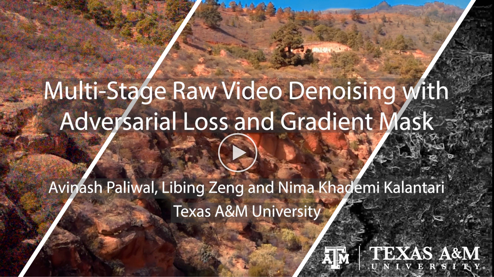

# MaskDnGAN [](https://opensource.org/licenses/mit-license.php)
Official PyTorch implementation of "Multi-Stage Raw Video Denoising with Adversarial Loss and Gradient Mask" [Project](https://people.engr.tamu.edu/nimak/Papers/ICCP2021_denoising) | [Paper](https://arxiv.org/abs/2103.02861)  

## Results
### Synthetic


### Real


## Prerequisites
This codebase was developed and tested on Ubuntu with PyTorch 1.3.1 and CUDA 10.1, Python 3.7.10 and Scipy 1.1.0. To install [PyTorch](https://pytorch.org/get-started/previous-versions/):

```bash
conda install pytorch==1.3.1 torchvision==0.4.2 cudatoolkit=10.1 -c pytorch
```

## Training
Set the dataset path and run:
```bash
python train.py --dataset_root path/to/dataset
```
Run the following commmand for help / more options like batch size, sequence length etc.
```bash
python train.py --h
```

### Tensorboard
To get visualization of the training, you can run tensorboard from the project directory using the command:
```bash
tensorboard --logdir logs --port 6007
```

and then go to [https://localhost:6007](https://localhost:6007).

## Evaluation
#### Evaluation code along with synthetic test set to be added soon!

## Video
[](https://www.youtube.com/watch?v=wY64fCseXZI)

## Citation
```
@InProceedings{paliwal2021maskdenosing,
  author={Paliwal, Avinash and Zeng, Libing and Kalantari, Nima Khademi},
  booktitle={2021 IEEE International Conference on Computational Photography (ICCP)}, 
  title={Multi-Stage Raw Video Denoising with Adversarial Loss and Gradient Mask}, 
  year={2021},
  pages={1-10}
}
```

## Acknowledgement
Parts of training code are adopted from [SPADE](https://github.com/NVlabs/SPADE), [RAFT](https://github.com/princeton-vl/RAFT), [UPI](https://github.com/timothybrooks/unprocessing) and [RViDeNet](https://github.com/cao-cong/RViDeNet).