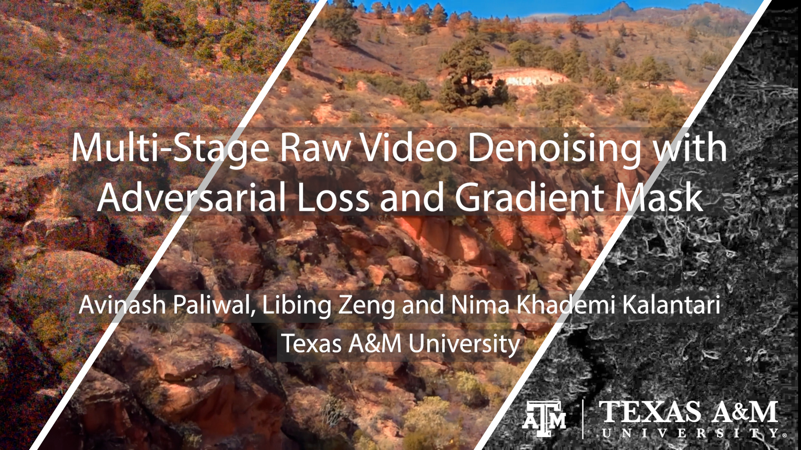

# MaskDnGAN [](https://opensource.org/licenses/mit-license.php)
Official PyTorch implementation of "Multi-Stage Raw Video Denoising with Adversarial Loss and Gradient Mask" [Project](https://people.engr.tamu.edu/nimak/Papers/ICCP2021_denoising) | [Paper](https://arxiv.org/abs/2103.02861)  

#### Code will be released soon!   

### Video
[](https://www.youtube.com/watch?v=wY64fCseXZI)

## References
```
@InProceedings{paliwal2021maskdenosing,
    title={Multi-Stage Raw Video Denoising with Adversarial Loss and Gradient Mask},
    author={Avinash Paliwal and Libing Zeng and Nima Khademi Kalantari},
    booktitle={arXiv},
    year={2021}
}
```
